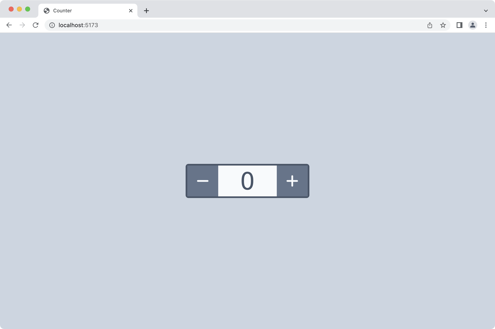

<div style="text-align:center"></div>

# Counter (Peact)

This is a basic implementation of a counter using [Preact](https://preactjs.com/).

## Live Demo

https://apps.lucaseverett.dev/counter/counter-preact/

## Installation

### Clone the repo

```sh
git clone https://github.com/lucaseverett/counter-preact.git
```

### Install NPM dependencies

```sh
npm install
```

## Usage

### Start dev server

```sh
npm run dev
```

### Run tests once

```sh
npm run test
```

### Run tests and watch for changes

```sh
npm run test:watch
```

### Run tests in browser

```sh
npm run test:ui
```

### View test coverage

```sh
npm run coverage
```

## Linting

### Lint with ESLint

```sh
npm run lint
```

### Format with Prettier

```sh
npm run format
```

## Building

### Build app

```sh
npm run build
```

### Preview build

```sh
npm run preview
```

## Related Projects

[Counter (Lit)](https://github.com/lucaseverett/counter-lit)

[Counter (React)](https://github.com/lucaseverett/counter-react)

[Counter (Solid)](https://github.com/lucaseverett/counter-solid)

[Counter (Svelte)](https://github.com/lucaseverett/counter-svelte)

[Counter (Vue)](https://github.com/lucaseverett/counter-vue)

[Counter (Vue JSX)](https://github.com/lucaseverett/counter-vue-jsx)
